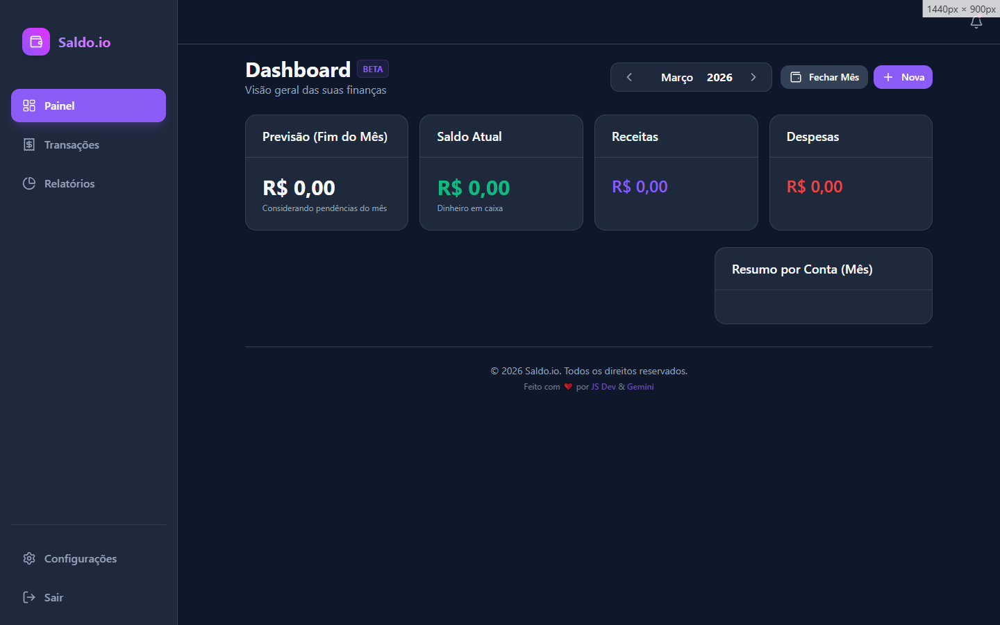
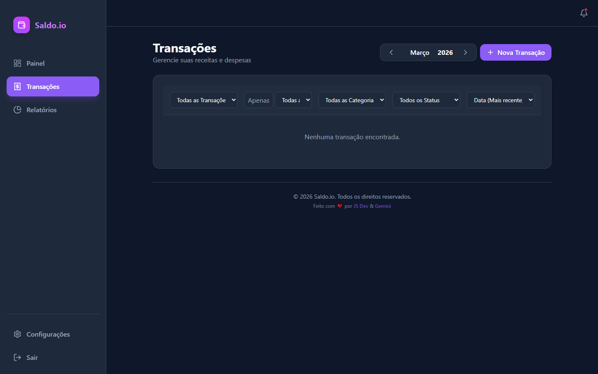
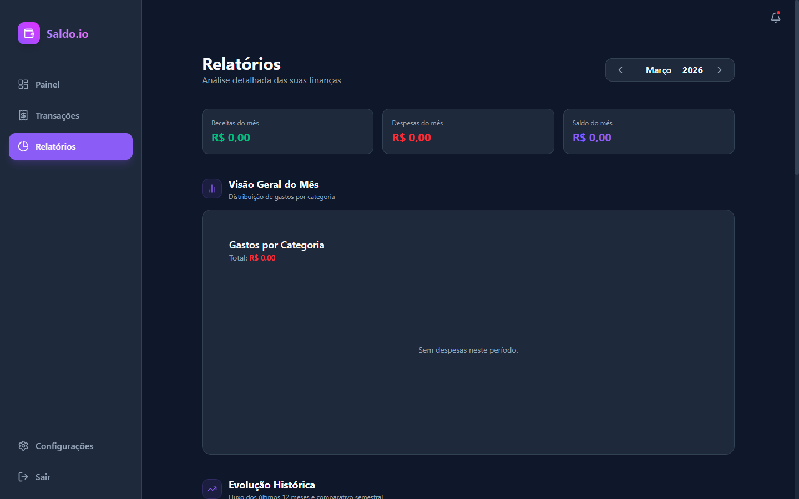
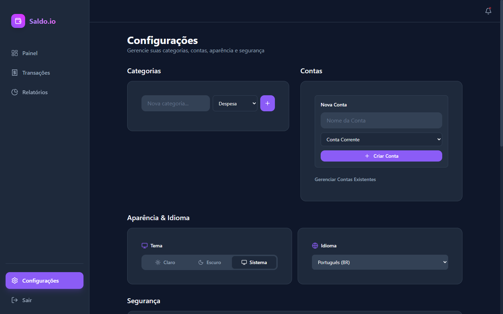

# 💰 Saldo.io

Aplicação web de finanças pessoais com foco em simplicidade, velocidade e visão clara do mês.

[](#-status-real-do-projeto)
[](LICENSE)

> Idiomas: **[Português](README.pt-BR.md)** · **[English](README.en.md)**

---

## O problema que resolve

Muita gente controla dinheiro em planilhas soltas, apps complexos demais ou anotações sem contexto mensal.
O **Saldo.io** resolve isso com:

- visão consolidada de **saldo, receitas e despesas**;
- controle de **contas e cartões** no mesmo fluxo;
- lançamentos **recorrentes** e **parcelados**;
- experiência rápida com arquitetura híbrida (cliente + nuvem).

---

## Demo pública

- **Status:** disponível via ambiente público de demonstração (quando configurado pelo mantenedor).
- **Conta demo:** pode ser habilitada/desabilitada no painel Admin.
- **URL sugerida para publicação:** `https://seu-projeto.vercel.app`

> Se você for o mantenedor, publique com Vercel/Cloudflare e atualize esta seção com a URL final.

---

## Screenshots (organizadas)

### Dashboard


### Transações


### Relatórios


### Configurações


---

## Tabela de features

| Área | Feature | Status |
|---|---|---|
| Dashboard | Saldo real/projetado e cards de resumo | ✅ Disponível |
| Transações | Criar, editar, excluir, filtrar | ✅ Disponível |
| Recorrência | Série mensal com propagação de edição | ✅ Disponível |
| Parcelamento | Despesas parceladas com controle por parcela | ✅ Disponível |
| Contas/Cartões | Gestão de contas bancárias e crédito | ✅ Disponível |
| Relatórios | Gráficos por categoria e fluxo mensal | ✅ Disponível |
| Backup | Exportação e restauração | ✅ Disponível |
| IA | Insights financeiros (configurável) | ⚠️ Parcial |
| Open Finance | Conexão bancária automática | 🕒 Planejado |

---

## Comparação Free vs Premium

| Recurso | Free | Premium |
|---|---:|---:|
| Contas bancárias | 1 | Ilimitadas |
| Cartões de crédito | 1 | Ilimitados |
| Lançamentos | Ilimitados | Ilimitados |
| Relatórios avançados | Limitado | Completo |
| Exportação CSV/PDF | ❌ | ✅ |
| Insights com IA | Limitado | ✅ |
| Backup em nuvem | ❌ | ✅ |
| Suporte prioritário | ❌ | ✅ |

> Referência completa de proposta comercial: `PRICING.pt-BR.md`.

---

## Setup local (instruções corretas)

### 1) Pré-requisitos
- Node.js 20+
- npm 10+
- Projeto Supabase (para autenticação e dados em nuvem)

### 2) Instalar dependências
```bash
npm install
```

### 3) Configurar variáveis de ambiente
Crie `.env` na raiz:

```env
VITE_SUPABASE_URL=SEU_SUPABASE_URL
VITE_SUPABASE_ANON_KEY=SUA_SUPABASE_ANON_KEY
# opcionais para área de doação/IA
VITE_PIX_KEY=
VITE_PIX_PAYLOAD=
```

### 4) Rodar em desenvolvimento
```bash
npm run dev
```

### 5) Build de produção
```bash
npm run build
npm run preview
```

---

## Arquitetura resumida

- **Frontend:** React 19 + Vite
- **Estado e cache:** TanStack Query + Context API
- **Backend:** Supabase (Postgres, Auth, RPC)
- **Visual:** Tailwind CSS + componentes customizados
- **Testes:** Vitest + Playwright

Fluxo geral:
1. Usuário autentica.
2. UI consulta dados via Supabase.
3. RPCs retornam resumos (saldo global, estatísticas mensais).
4. Dashboard renderiza cards, gráficos e listas.

---

## Roadmap enxuto

- [ ] Finalizar onboarding guiado com telemetria de ativação
- [ ] Melhorar plano Free/Premium com feature flags
- [ ] Evoluir insights de IA com sugestões acionáveis
- [ ] Publicar documentação de APIs/RPCs

---

## Status real do projeto

- **Fase:** Beta
- **Maturidade:** funcional para uso real, ainda em evolução contínua
- **Pontos fortes atuais:** fluxo principal de transações, dashboard e relatórios
- **Pontos em andamento:** ajustes de onboarding, expansão de testes E2E e monetização

Se quiser, posso também padronizar esse mesmo formato no `README.pt-BR.md` e `README.en.md` para manter tudo consistente.
